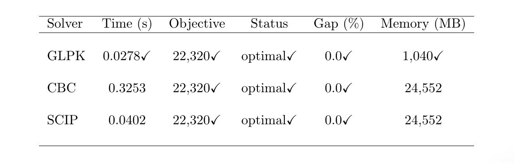

# Capacitated Facility-Location MIP with Open-Source Solvers
This repository contains the codes of tutorial posted on [https://medium.com/@abdullahiadinoyi857](https://medium.com/@abdullahiadinoyi857)

# what's included

```bash
2/
│── data/
│── data.py
│── facility.py
│── metrics.py
│── plot/
│── plot.py
│── test.ipynb
│── README.md
```

- ```data/```: contrained the .csv files namely `warehouses.csv`, `customers.csv` and `distances.csv`
- ```data.py```: load the data and prepare it for modeling
- ```facility.py```: to build and solve the MIP with 3 solvers namely GLPK, CBC and SCIP
- ```metrics.py```: benchmark solvers on metrics and return results as a DataFrame.
- ```plot.py```: visualize results
- ```plot/```: contains saved plots
- ```test.ipynb```: 
- ```README.md```: is this file you're currently reading

# How to run the code locally

```bash
# create a new env
conda create -n mip-env python=3.9

# activate the env
conda activate mip-env

# install needed libs
conda install -c conda-forge \
    pyomo pandas matplotlib \
    glpk coin-or-cbc

# install the SCIP CLI 
conda install -c conda-forge scip
```

Now verify the solvers using:
```bash
which glpsol 
which cbc     
which scip
```
Once that’s done, always activate `mip-env` before running your code. Now, in the same shell run the following:

```bash
python facility.py
python metrics.py
python plot.py
```

or launch Jupyter:

```bash
jupyter lab
```
and import your modules there.

# Metrics
We show the comparison table here, other plots are located in the tutorial

<p align="center" width=10%>
<br>
</p>

# Questions?
You can create an issue here if there is anything to be addressed.

# Contact
You can reachout here [Abdullahi Adinoyi Ibrahim](https://github.com/aadinoyiibrahim)

